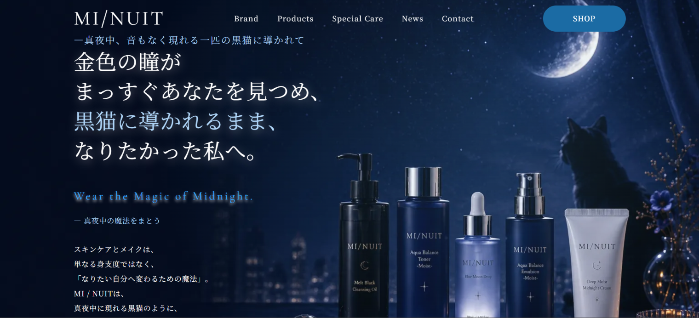

# 💄 MI/NUIT - ブランドサイト制作

## 🌐 Demo

https://〇〇.github.io/MI-NUIT/

## 📂 Repository

https://github.com/〇〇/MI-NUIT

## 📷 Preview

## 📖 プロジェクト概要

「**MI/NUIT（ミニュイ）**」は、架空のスキンケア・化粧品のブランドサイトです。

ブランドコンセプトからサイト設計、デザイン、コーディングまでを一貫して制作しました。幻想的で高級感のある世界観を表現し、商品の魅力を伝えながら、ユーザーが直感的に商品を探し、購入までスムーズに進めるUI・UXを目指しています。

---

## 🎯 ターゲット（ペルソナ）

* 20〜30代の美容やトレンドに関心の高い女性
* SNSや口コミを参考にコスメを選ぶ方
* デザイン性だけでなく、品質や使いやすさも重視する方

---

## 🚀 制作目的（GOAL）

* ブランドイメージを高める
* 商品の魅力を分かりやすく伝える
* オンラインショップへの導線を設計し、購入につなげる
* レスポンシブ対応を行い、スマートフォンでも快適に閲覧できるサイトを制作する

---

## ✨ デザインコンセプト

> **「真夜中の魔法で、まだ知らない自分に出会う。」**

毎日のスキンケアやメイクの時間を、
少し特別な時間へ変えるブランド体験をコンセプトに、
幻想的で上品な世界観を表現しました。

---

## 🎨 デザインイメージ

* 高級感
* 幻想的
* 韓国コスメ
* 上品
* 洗練
* 神秘的
* 透明感

---

## 🎨 カラーパレット

| 用途       | カラー             |
| -------- | --------------- |
| ベースカラー   | ミッドナイトブルー       |
| サブカラー    | ホワイト・ブラック       |
| アクセントカラー | ゴールド・ラベンダー・シルバー |

---

## 🔤 使用フォント

| 用途  | フォント                |
| --- | ------------------- |
| 見出し | Marcellus           |
| 本文  | Zen Kaku Gothic New |

---

## 👤 ユーザーシナリオ

SNSでブランドを知った20代女性がサイトを訪問。

ブランドコンセプトに興味関心が高まり、商品一覧を閲覧する。
商品の特徴等を確認しながら商品を比較し、気になった商品をカートへ追加。そのままスムーズに商品を購入。口コミなどの投稿によりブランドの知名度が上がる。

---

## 📄 サイト構成

* TOP
* Products
* Product Detail
* About
* Contact

---

## 🛠 使用技術

* HTML5
* CSS3
* JavaScript
* Swiper.js
* Git / GitHub
* GitHub Pages

---

## 📱 主な実装内容

* レスポンシブデザイン
* Swiperによる商品スライダー
* 商品一覧ページ
* 商品詳細ページ
* ショッピングカート機能
* スクロールアニメーション
* お問い合わせフォーム
* モダンなUIデザイン

---

## ⚠️ 制作上のポイント

* HTML5のセマンティックタグを使用
* FLOCSSを意識したCSS設計
* 保守性・可読性を重視したコーディング
* PC・タブレット・スマートフォンに対応
* ユーザーが迷わず操作できるUI・UXを意識

---

## 💡 制作で工夫した点

- 高級感のある韓国コスメブランドを意識したデザイン
- ミッドナイトブルーを基調に世界観を統一
- レスポンシブ対応でスマートフォンでも快適に閲覧可能
- JavaScriptで商品一覧・カート機能を実装
- FLOCSSを意識したCSS設計で保守性を向上

## 📝 備考

本サイトはポートフォリオ作品として制作した架空のブランドサイトです。

掲載している画像は、自作または利用規約に従って使用可能な素材を使用しています。一部画像にはAIを活用して制作したものが含まれています。
